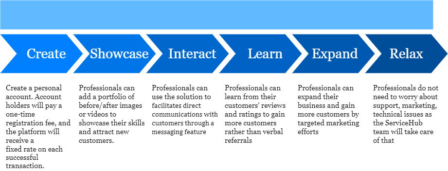

# Documentation

This documentation enables you to integrate with our service easily. 
## Documentation Summary
{}
## Contribute to this documentation
Feel free to update this content, just click the Edit this page link displayed on top right of each page, and pullrequest it
{}
Your modification will be deployed automatically when merged.
{}

## Lorem ipsum
Lorem ipsum dolor sit amet, consectetur adipiscing elit. Phasellus eget purus blandit lacus finibus semper. Fusce faucibus quam ac nulla bibendum sodales. Aenean eu hendrerit odio. Cras eu ornare nunc, vel luctus lorem. Aliquam eu malesuada risus. Cras velit urna, facilisis non erat non, fermentum tincidunt nisi. Nullam quis massa vel nisi ultricies laoreet. Sed faucibus mollis ante at dignissim. Donec interdum suscipit lacus. Fusce porttitor nulla et dui porta, a egestas magna lobortis. Maecenas et ante libero.

Answers are [available here](www.google.com)

